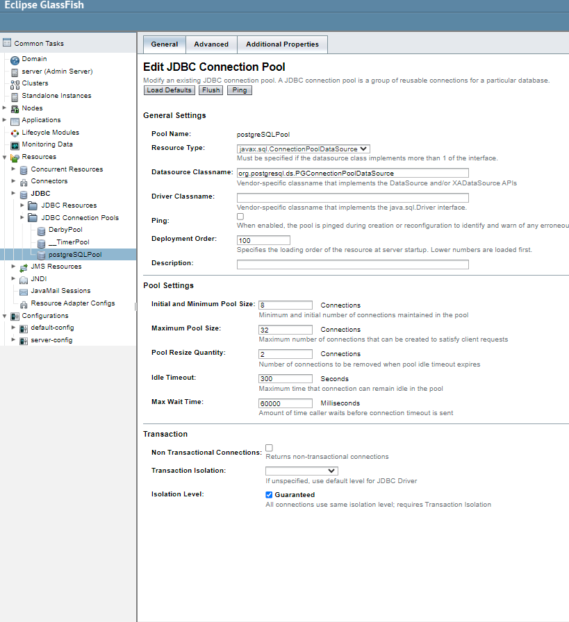

JavaEE

Лабораторная посвящена разработке на JavaEE

Используемые инструменты: JakartaEE, PostgreSQL, Glassfish.

Предметная область - IT проекты

В ходе данной работы был подключен jdbc для работы с PostgreSQL в Glassfish.

Бины в проекте:
Entity Bean - Entity class: Project, Command.
Stateless Session Bean.

Слой отображения был выбран формируемый html в servlet.

