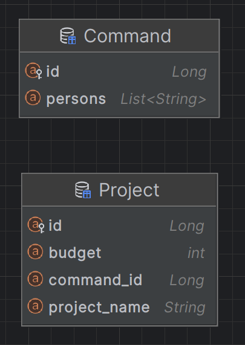

Lab2 Spring
=

Лабораторная посвящена разработке на Spring MVC

Используемые инструменты: Spring MVC, PostgreSQL, Tomcat, PostgreSQL

Предметная область - IT проекты

Используемые бины: Repository, Entity, Controller

Слой просмотра был реализован через freemarker

