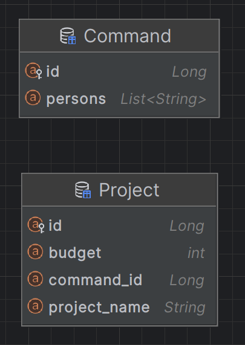
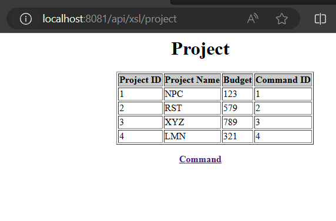
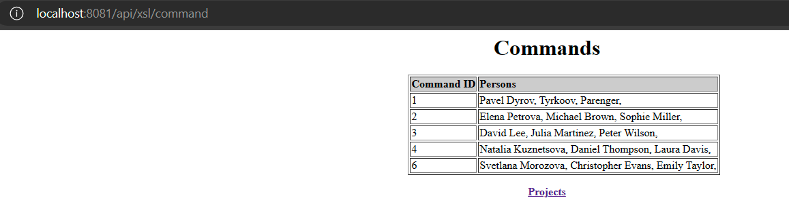

Lab3 REST
=

1. JAX-RS:
- Стандартизация: JAX-RS - это стандартный API для создания веб-сервисов RESTful на Java, что означает, что он не зависит от поставщика и может быть реализован разными поставщиками.
- Легкий: JAX-RS - это легкий фреймворк, который предоставляет аннотации для определения ресурсов, методов и параметров, что делает его простым в использовании и понимании.
- Интеграция: JAX-RS может быть легко интегрирован с другими технологиями Java EE, такими как CDI (внедрение контекстов и зависимостей) и EJB (Enterprise JavaBeans).

2. Spring REST:
- Интеграция с экосистемой Spring: при использованни Spring framework для других аспектов разработки, использование Spring REST может обеспечить плавную интеграцию с другими компонентами Spring.
- Богатый набор функций: Spring REST предоставляет богатый набор функций, таких как встроенная поддержка согласования содержимого, обработка исключений, проверка подлинности и безопасность.
- Поддержка сообщества: Spring framework имеет большое и активное сообщество.

Поскольку во 2 лабораторной использовался Spring, было решено использовать Spring REST

Используемые инструменты: Spring REST, PostgreSQL.

Предметная область - IT проекты

Были созданы RestControllers, которые позволяли использовать как XML, так и JSON.
Было разработано XSL-преобразование для XML объектов.

Endpoint - /api/xsl/project

/api/xsl/command

